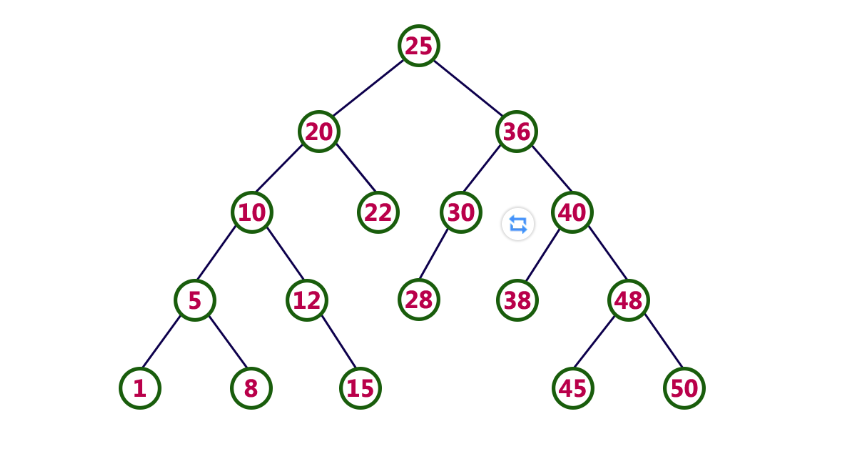
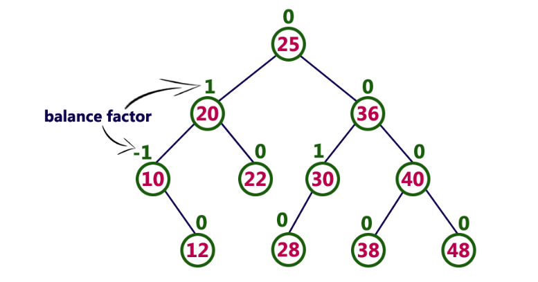
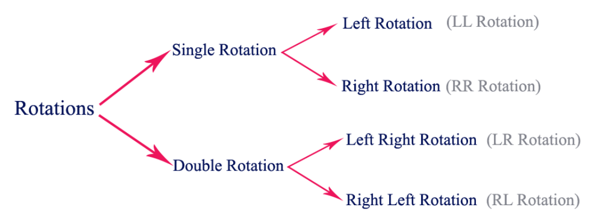
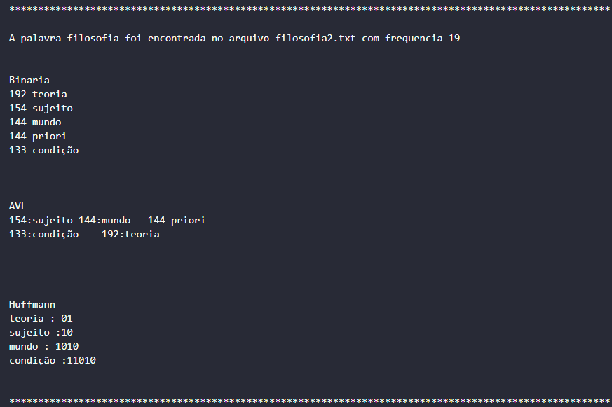

<h1 align="center">Autocomplete-System-and-Word-Suggestions</h1>

<p style="font-size:120%;" align="center">
    <a href="#problema">Problema</a> -
    <a href="#desenvolvimento">Desenvolvimento</a> -
    <a href="#resultados">Resultados</a> -
    <a href="#conclusao">Conclusão</a> -
    <a href="#executar">Executar</a> -
    <a href="#contatos">Contatos</a>
</p>

# Problema

Neste trabalho, o objetivo é criar um sistema que possibilite a funcionalidade de autocompletar
e oferecer sugestões de palavras aos usuários. Para atingir essa finalidade, adotaremos a
estrutura da árvore binária como base. A seguir, é apresentado os passos necessários para a
implementação.
Passo 1: Coleta de Dados
Iniciamos solicitando ao usuário um arquivo denominado input.data, contendo uma lista de
palavras. Cada palavra nesse arquivo será considerada como termo de pesquisa para o sistema.
Passo 2: Modelo de Dados - Árvores Binárias
Utilizaremos um conjunto de árvores binárias para construir nosso sistema. Essas árvores
serão criadas a partir de textos previamente fornecidos (disponíveis em textos.zip). O objetivo
é estabelecer uma relação entre as palavras dos textos e as palavras de pesquisa.
Passo 3: Sugestões de Palavras Relevantes
Para cada palavra no arquivo input.data, percorreremos as árvores binárias para identificar as
palavras mais relevantes e próximas à palavra de pesquisa. Priorizaremos palavras frequentes
e associadas ao termo de pesquisa.
Passo 4: Resultados e Análises
Os resultados da análise serão apresentados em um arquivo chamado output.data. Esse arquivo conterá as relações entre as palavras pesquisadas e cada arquivo de texto. Além disso,
a relevância de cada palavra será calculada com base em sua frequência nos textos. Para tal,
utilize o trabalho recentemente realizado, o contador de palavras.

**Abordagem de Implementação**
A abordagem consistirá em três etapas diferentes:
1. **Árvore Binária Padrão**: Implementaremos uma árvore binária tradicional, selecionando as palavras mais relevantes e relacionadas à pesquisa em cada texto. A relevância de uma palavra será determinada por sua frequência e proximidade à palavra de pesquisa.
2. **Codificação de Huffman**: Exploraremos o uso do código de Huffman para otimizar
a árvore binária padrão. Calcularemos códigos para cada palavra e reorganizaremos a
estrutura da árvore com base nesses códigos. Avaliaremos se essa abordagem oferece
vantagens em relação à anterior.
3. **Árvore AVL**: Implementaremos uma árvore AVL e repetiremos o processo de análise.
Compararemos o tempo médio de processamento entre a construção da estrutura e a
geração de saída em comparação com as abordagens anteriores.


# Desenvolvimento

## O problema foi desenvolvido da seguinte maneira:

A solução proposta é baseada em um programa C++ que tem como objetivo principal analisar um arquivo de texto, considerando vários parâmetros. O arquivo de entrada é um arquivo .txt com uma estrutura específica, onde cada sentença termina com um sinal de pontuação e cada parágrafo é separado por pelo menos uma linha em branco.

A base da hash é a mesma do ultimo trabalho que tivemos em AEDS 2 link do respositorio

São definidas as classes e estruturas de dados utilizadas no programa, como a classe `WordInfo` .

A função `TextCollector` lê um arquivo de texto e retorna um vetor de pares, onde cada par contém o número da linha e o conteúdo da linha. A função `DivideParagrafos` recebe o vetor de pares do arquivo de texto e realiza a divisão em parágrafos, sentenças e palavras, retornando uma estrutura de dados aninhada para representar essa estrutura.

Outras funções implementadas incluem `StopWordExtractor` , que lê arquivos de stopwords, respectivamente, e retornam um conjunto de strings contendo essas palavrass.

A função `TextAnalyzer` é responsável por analisar o texto dividido em parágrafos, sentenças e palavras, utilizando as stopwords e expressões fornecidas. Essa função percorre as estruturas de dados, realiza contagens de palavras, gera relatórios e atualiza informações sobre as ocorrências das expressões.


A função  `Inserirbinaria` insere um novo nó na árvore binária. Ela recebe um ponteiro para um ponteiro binaria e um Item como entrada. Se o ponteiro apontado por bin for NULL, a função cria um novo nó e inicializa seus campos com os valores do Item. Se o nó já existir na árvore, a função insere a palavra no vetor palavras se a frequência for igual.


Já a função `preOrdemBinaria` percorre a árvore binária em pré-ordem e imprime a frequência e a palavra de cada nó, seguidos das palavras associadas ao nó, se houverem

## AVL

A função `Tree *CreateTree` cria uma árvore AVL.

A função `insertTree` Esta função insere um novo nó na árvore AVL. 


## HUFMAN

Foi usada uma fila de prioridade `priority_queue`, para armazenar os nós e os ponteiros.

Uma árvore de Huffman é uma árvore binária em que cada nó interno tem dois filhos. Além disso, árvores de Huffman ignoram a relação de ordem (esquerdo, direito) entre os filhos de um nó. Para melhor estudar essas árvores, adotaremos uma definição mais abstrata que a usual.

No geral, a implementação desse código demonstra o uso de estruturas de dados, manipulação de arquivos, processamento de texto, criação de árvores e geração de relatórios. O programa é organizado e modularizado, facilitando a compreensão e manutenção do código. A utilização de técnicas como leitura de arquivos, busca em estruturas de dados e manipulação de strings permite a análise do texto e a geração de informações relevantes para o usuário.

## Árvore de pesquisa binária

<div align="justify">

Em uma `árvore binária`, cada nó pode ter no máximo dois filhos, mas não há necessidade de manter a ordem dos nós com base em seus valores. Em uma árvore binária, os elementos são organizados na ordem em que chegam à árvore de cima para baixo e da esquerda para a direita.

Uma árvore binária tem as seguintes complexidades de tempo...

1   - Operação de Busca - O(n)

2   - Operação de Inserção - O(1)

3   -Operação de exclusão - O(n)

Para melhorar o desempenho da árvore binária, usamos um tipo especial de árvore binária conhecida como Binary Search Tree. A árvore de pesquisa binária se concentra principalmente na operação de pesquisa em uma árvore binária. A árvore de pesquisa binária pode ser definida da seguinte forma...

### Exemplo
A árvore a seguir é uma árvore de pesquisa binária. Nessa árvore, a subárvore esquerda de cada nó contém nós com valores menores e a subárvore direita de cada nó contém valores maiores.

<p align="center">
 
</p>
<p align="center">
</p>

Operações em uma árvore de pesquisa binária
As operações a seguir são executadas em uma árvore de pesquisa binária...

### 1   -Procurar

### 2   -Inserção

### 3   -Deleção

# Operação de busca no BST

* Passo 1 - Leia o elemento de pesquisa do usuário.

* Passo 2 - Compare o elemento de pesquisa com o valor do nó raiz na árvore.

* Passo 3 - Se ambos forem correspondidos, exiba "Dado nó encontrado!!" e encerre a função

* Passo 4 - Se ambos não forem correspondidos, verifique se o elemento de pesquisa é menor ou maior que esse valor de nó.

* Passo 5 - Se o elemento de pesquisa for menor, continue o processo de pesquisa na subárvore esquerda.

* Passo 6- Se o elemento de pesquisa for maior, continue o processo de pesquisa na subárvore direita.

* Passo 7 - Repita o mesmo até encontrarmos o elemento exato ou até que o elemento de pesquisa seja comparado com o nó da folha

* Passo 8 - Se chegarmos ao nó com o valor igual ao valor de pesquisa, exibiremos "Element is found" e encerraremos a função.

* Passo 9 - Se chegarmos ao nó da folha e se ele também não for correspondido com o elemento de pesquisa, então exiba "O elemento não foi encontrado" e encerre a função.

# Operação de Inserção em BST
* Passo 1 - Crie um newNode com determinado valor e defina sua esquerda e direita como NULL.

* Passo 2 - Verifique se a árvore está vazia.

* Passo 3 - Se a árvore for Empty, defina root como newNode.

* Passo 4 - Se a árvore não estiver vazia, verifique se o valor de newNode é menor ou maior que o nó (aqui é nó raiz).

* Passo 5 - Se newNode for menor ou igual ao nó, mova para seu filho esquerdo. Se newNode for maior que o nó, mova para seu filho direito.

* Passo 6- Repita as etapas acima até chegarmos ao nó da folha (ou seja, chegamos a NULL).

* Passo 7 - Depois de alcançar o nó da folha, insira o newNode como filho esquerdo se o newNode for menor ou igual a esse nó da folha ou então insira-o como filho direito.

# Operação de exclusão no BST
* Caso 1: Excluindo um nó Folha (um nó sem filhos)

* Caso 2: Excluindo um nó com um filho

* Caso 3: Excluindo um nó com dois filhos

## Estrutura de dados da árvore AVL

A árvore AVL é uma árvore de pesquisa binária com equilíbrio de altura. Isso significa que uma árvore AVL também é uma árvore de busca binária, mas é uma árvore equilibrada. Uma árvore binária é dita equilibrada se, a diferença entre as alturas das subárvores esquerda e direita de cada nó na árvore é -1, 0 ou +1. Em outras palavras, uma árvore binária é dita equilibrada se a altura dos filhos esquerdo e direito de cada nó diferem por -1, 0 ou +1. Em uma árvore AVL, cada nó mantém uma informação extra conhecida como fator de equilíbrio. A árvore AVL foi introduzida no ano de 1962 por G.M. Adelson-Velsky e E.M. Landis.

<p align="center">
 
</p>
<p align="center">
</p>

# Rotações de árvore AVL
Na árvore AVL, depois de realizar operações como inserção e exclusão, precisamos verificar o fator de equilíbrio de cada nó na árvore. Se cada nó satisfaz a condição do fator de equilíbrio, então concluímos a operação, caso contrário, devemos torná-la equilibrada. Sempre que a árvore fica desequilibrada devido a qualquer operação, usamos operações de rotação para tornar a árvore equilibrada.
Existem quatro rotações e elas são classificadas em dois tipos.

<p align="center">
 
</p>
<p align="center">
</p>

# Operações em uma árvore AVL

As seguintes operações são executadas na árvore AVL...

* 1   -Procurar
* 2   -Inserção
* 3   -Deleção

# Operação de pesquisa na árvore AVL
Em uma árvore AVL, a operação de pesquisa é executada com complexidade de tempo O(log n). A operação de pesquisa na árvore AVL é semelhante à operação de pesquisa em uma árvore de pesquisa binária. Usamos as seguintes etapas para pesquisar um elemento na árvore AVL...

* Passo 1 - Leia o elemento de pesquisa do usuário.

* Passo 2 - Compare o elemento de pesquisa com o valor do nó raiz na árvore.

* Passo 3 - Se ambos forem correspondidos, exiba "Dado nó encontrado!!" e encerre a função

* Passo 4 - Se ambos não forem correspondidos, verifique se o elemento de pesquisa é menor ou maior que esse valor de nó.

* Passo 5 - Se o elemento de pesquisa for menor, continue o processo de pesquisa na subárvore esquerda.

* Passo 6 - Se o elemento de pesquisa for maior, continue o processo de pesquisa na subárvore direita.

* Passo 7 - Repita o mesmo até encontrarmos o elemento exato ou até que o elemento de pesquisa seja comparado com o nó da folha.

* Passo 8 - Se chegarmos ao nó com o valor igual ao valor de pesquisa, então exibiremos "O elemento foi encontrado" e encerraremos a função.

* Passo 9 - Se chegarmos ao nó da folha e se ele também não for correspondido com o elemento de pesquisa, então exiba "O elemento não foi encontrado" e encerre a função.

# Operação de inserção na árvore AVL
Em uma árvore AVL, a operação de inserção é realizada com complexidade de tempo O(log n). Na árvore AVL, um novo nó é sempre inserido como um nó de folha. A operação de inserção é realizada da seguinte forma...

* Passo 1 - Insira o novo elemento na árvore usando a lógica de inserção da Árvore de Pesquisa Binária.

* Passo 2 - Após a inserção, verifique o Fator de Equilíbrio de cada nó.

* Passo 3 - Se o Fator de Equilíbrio de cada nó for 0 ou 1 ou -1, vá para a próxima operação.

* Passo 4 - Se o Fator de Equilíbrio de qualquer nó for diferente de 0 ou 1 ou -1, então essa árvore é considerada desequilibrada. Neste caso, execute a rotação adequada para torná-la equilibrada e vá para a próxima operação.

# Operação de exclusão na árvore AVL
A operação de exclusão no AVL Tree é semelhante à operação de exclusão no BST. Mas após cada operação de exclusão, precisamos verificar com a condição Fator de Equilíbrio. Se a árvore estiver balanceada após a exclusão, vá para a próxima operação, caso contrário, execute a rotação adequada para tornar a árvore Balanceada.

Foi implementado as seguintes estruturas no trabalho:

Contêineres Associativos:

- Unordered_set -> https://cplusplus.com/reference/unodered_set
- Unordered_map -> https://cplusplus.com/reference/unordered_map/unordered_map/

**unordered_set:** É uma implementação de um conjunto (set) não ordenado usando tabelas hash. Os elementos são armazenados em posições determinadas por suas chaves (hashes). Isso permite que as operações de inserção, remoção e busca tenham uma complexidade média de O(1), em média, tornando-as muito eficientes.

**unordered_map:** É uma implementação de um mapa (map) não ordenado usando tabelas hash. Cada elemento é um par de chave-valor, onde a chave é usada para acessar o valor. Assim como no unordered_set, as operações de inserção, remoção e busca também têm uma complexidade média de O(1), em média.

Contêineres de Sequência:

- Vector -> https://cplusplus.com/reference/vector/vector/

> Todas essas estruturas já estão implementadas como bibliotecas no C++, basta chamá-las.

```cpp
#include <vector>
#include <unordered_set>
#include <unordered_map>
```


# Resultados

<p align="center">
 
</p>
<p align="center">
</p>

### A saida esperada para o programa:

```cpp
        while (arquivo >> palavra_pesq) {
            for (auto &par : par_txt) {
                if (NoTexto(par.second, palavra_pesq)) {
                    unordered_map<string, int> frequencia = occurrenceCounter(par.second);

                    int freq_encontrada = 0;

                    if (frequencia.find(palavra_pesq) != frequencia.end()) {
                        freq_encontrada = frequencia[palavra_pesq];
                    }

                    HeapMAX Heap;

                    for (const auto &item : frequencia) {
                        Heap.inserir(DataPair(item.first, item.second));
                    }

                    binaria *bin = Retornobinaria();
                    Tree *AVL = CreateTree();

                    for (int i = 0; i < MAX_TOP_WORDS && !Heap.Vazia(); i++) {
                        DataPair top = Heap.PesquisaMAX();
                        Item item;
                        item.freq = top.freq;
                        item.palavra = (char *)malloc(top.palavra.size() + 1);
                        strcpy(item.palavra, top.palavra.c_str());

                        Record rec;
                        rec.key = top.freq;
                        rec.palavra = (char*)malloc(top.palavra.size() + 1);
                        strcpy(rec.palavra, top.palavra.c_str());

                        Inserirbinaria(&bin, item);
                        insertTree(&AVL, rec);
                    }
                }
            }
        }

```


# Conclusão

A inserção dos dados foi feita a partir dos arquivos que está no **dataset**, ou seja, qualquer arquivo .txt com o nome input será lido, independe do número adicionado no final, por exemplo input0,input02 ... e assim sucessivamente. A complexidade do trabalho foi bem dividida em funções e estruturas de dados, permitindo uma implementação modular e organizada. O uso de contêineres associativos da biblioteca unordered, como unordered_map e unordered_set, facilitou a contagem de frequências das palavras.

Para inserir as palavras e a partir dela obter as árvores, basta ir em **dataset** , **input.txt** e adicionar as palavras desejadas

No geral, o trabalho demonstra a aplicação prática de estruturas de dados e algoritmos para resolver um problema específico. Ele apresenta o uso de hash para contagem de frequências e o uso de heap para manter os "k" elementos mais frequentes, além da inserção da árvoree Binária, AVL e o Huffman.

# Executar

- Como executar:

| Comando      | Função                                                                                  |
| ------------ | --------------------------------------------------------------------------------------- |
| `make clean` | Apaga a última compilação realizada contida na pasta build                              |
| `make`       | Executa a compilação do programa utilizando o gcc, e o resultado vai para a pasta build |
| `make run`   | Executa o programa da pasta build após a realização da compilação                       |

# Contatos

<div>
<a href="https://t.me/ygorvieira111">
 
</a>

<a href="https://www.linkedin.com/in/ygor-santos-vieira/">

</a>
</div>
<p></p>

[](mailto:mesquitagabriel30@gmail.com)
